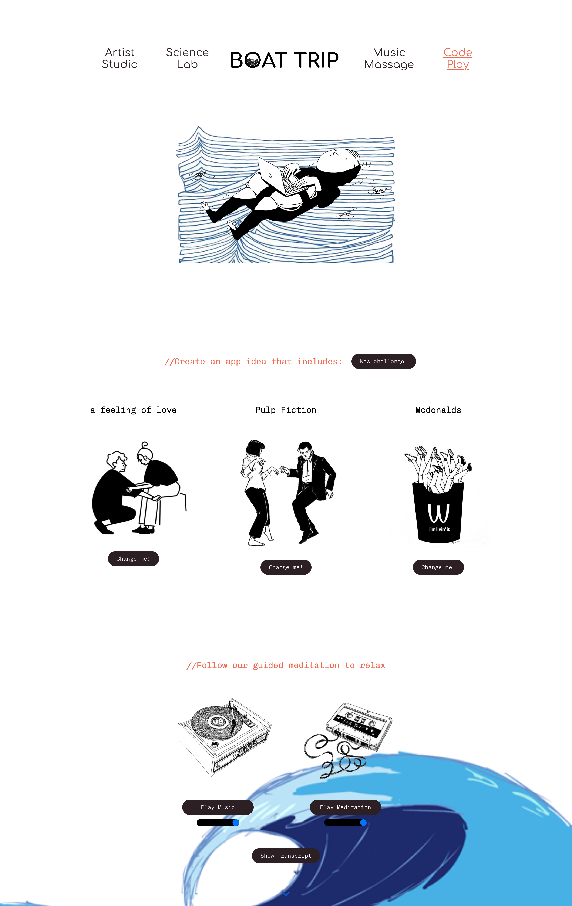

#🚀 Mid-term 𝑷𝒓𝒐𝒋𝒆𝒄𝒕 𝑾𝒆𝒆𝒌 🚀
Bootcamp: {Week 6} at the School of Code

##🛥 𝘽𝙤𝙖𝙩 𝙏𝙧𝙞𝙥 🛥
Introducing Boat Trip, an energiser app built to combat mental and creativity burnout in coding bootcamps. With the increasing pressure and intensity in learning how to code just in 16 weeks, it's easy to feel like you're all at sea, struggling to stay afloat. But now, please come onboard, take a moment to relax, ride the waves, and recharge.

 

 ##🌊 Deployment:
 👉 https://lnkd.in/dJ3ZDP-u
 
🌊 🌊 🌊 🌊

## 📌 User Story:
"As a coding bootcamper, 
I want to avoid burnout,
so that I can get the most 
out of my time on this course."

## 📌 Problems:
Mental burnout and creativity burnout.

## 📌 Unique Features:
This MVP offers 2 stress-reducing activities tailor-made for bootcampers that also aim to boost their creativity.

✨Artist Studio: 
Users are given a set of creative challenges to train their brain muscles and come up with innovative ideas. For example, create an app idea for those in *Pulp Fiction* to use in a *cat restaurant* with *a sense of humour*. Feel free to get a little crazy and build that connection that you would never thought of before.

✨Music Massage: 
Our AI-generated guided meditation with soothing music is specifically tailored for bootcampers, offering a much-needed break from a day of hard-work. So forget about coding for just a few minutes and "we are swapping the bootcamp for breathing, and swapping react for relaxing..." Give it a go and share your feedback with us!

Let's ride the waves of inspiration, explore uncharted territories and emerge with newfound clarity and energy!!!

## 📌 Future Expansion and Vision:
We aim to expand Boat Trip by adding two additional rooms in the future. The Science Lab will offer users a chance to learn fun facts about various science topics. In Code Play, users will enjoy relaxing games that allow them to practice their coding skills in a stress-free environment, providing a contrast to the intense atmosphere of Code War.

## 🔎 Team Members: 
👩🏼‍🎨 👩🏻‍🚀 🧑🏻‍🔬 🕵🏿 💬
Meet the amazing team of Artology - Lee Palmer, Carrie Shen, Hildigunnur Sigvaldadóttir and Katim Touray! We are from the UK, Iceland and Hong Kong, all currently embarking on a 16-week coding bootcamp at the School of Code, where we are honing our skills to become full-stack software developers. With a passion for teamwork and a hunger for knowledge, Artology is sailing full speed ahead into the world of wonders! 